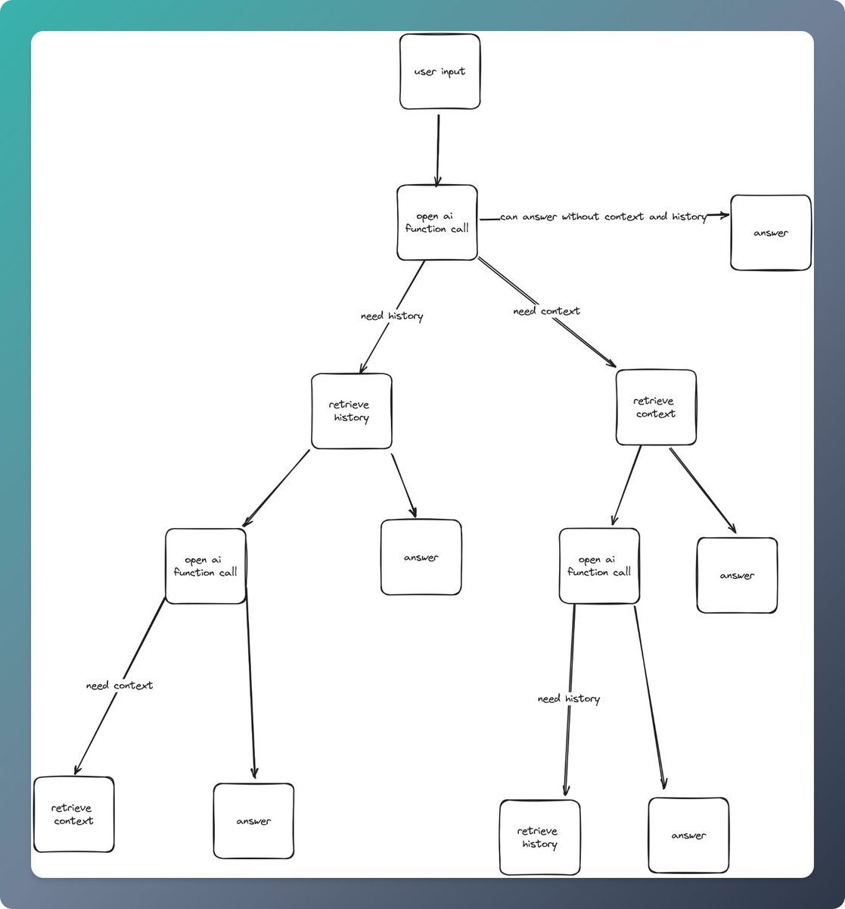

# Introduction to Chains

Attri uses a framework called [Langchain](https://python.langchain.com/docs/get_started/introduction.html) for the majority of the interaction with the Large Language Models (LLMs).

Langchain provides functionality to connect multiple components such as LLMs, document retrievers, and other components together to form a "chain" of components.

They define a Chain very generically as a sequence of calls to components, which can include other chains. For example, a chain could be a sequence of calls to a document retriever, followed by a call to an LLM, followed by a call to a summarizer.

## Conversational Retrieval Chains

In Attri we make use of the Conversational Retrieval Chain. These chains take in chat history and new questions and return an answer to the question. The algorithm for Conversational Retrieval Chains consists of three parts:

1. Creating a standalone question: The chat history and new question are combined to create a standalone question. This is done to ensure that relevant context is included in the retrieval step without unnecessary information from the whole conversation.

2. Retrieving relevant documents: The standalone question is passed to a retriever, which fetches relevant documents.

3. Generating a final response: The retrieved documents are passed to a language model (LLM) along with either the new question or the original question and chat history. The LLM generates a final response based on this input.

## OpenAI Functions

Attri also uses OpenAI Functions for the newer models. OpenAI Functions allow us to define out own version of a lightweight Conversational Retrieval Chain. In this case we ask the LLM if it can answer the question directly or if it needs either history or history and context. If it needs history and context, we pass the question and history to a retriever which performs a simple vector similarity search and then pass the retrieved documents to the LLM as context.

Using this method we can get the simular results as the Conversational Retrieval Chain but with a much simpler implementation and less then 1/2 of the latency.

See the diagram below for a visual representation:

